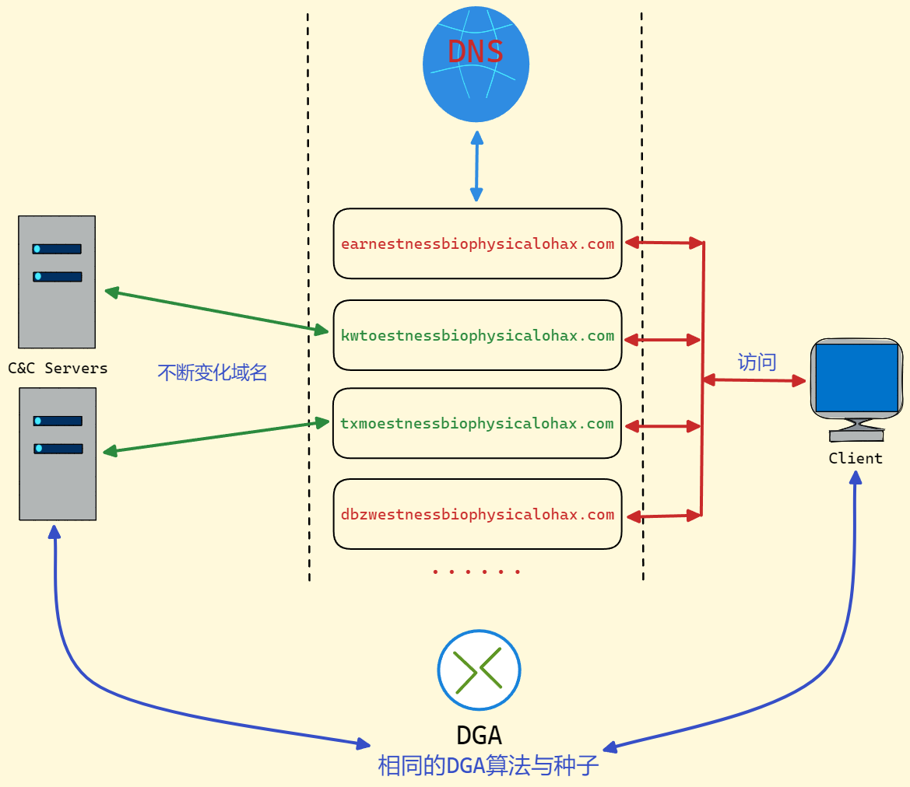
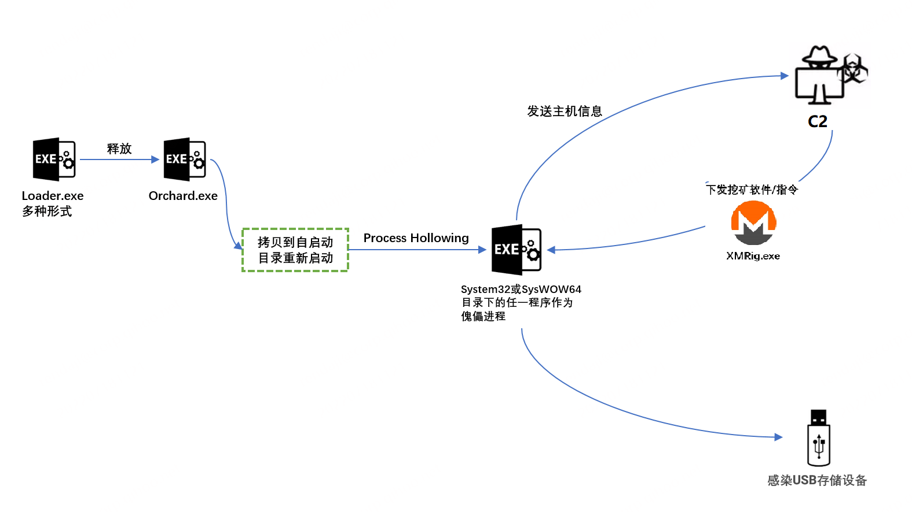
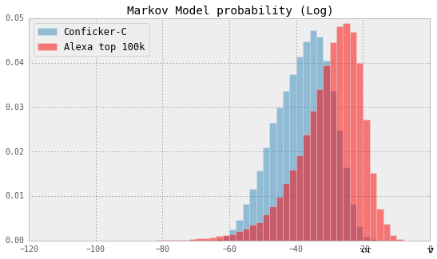

# 简介

>DGA（Domain generation algorithms），中文名：**域名生成算法**，其可以生成大量随机的域名来供恶意软件连接C&C控制服务器。 恶意软件编写者将采用同样的种子和算法生成与恶意软件相同的域名列表，从中选取几个来作为控制服务器，恶意软件会持续解析这些域名，直到发现可用的服务器地址。

## C2 & DGA



很显然，在这种方式下，传统基于黑名单的防护手段无法起作用：
1.  黑名单的更新速度远远赶不上DGA域名的生成速度；
2. 一般来说，一个DGA域名的存活时间通常在1-7天左右；
3. 防御者必须阻断所有的DGA域名才能阻断C2通信；
因此，DGA域名的使用使得攻击容易，隐蔽性提高，防御变得困难。

最近使用 DGA 创建命令和控制 (C&C) 服务器的恶意软件攻击示例包括 Conficker、Zeus 和 Dyre。

# DGA域名分类
DGA算法由两部分构成，种子（算法输入）和算法，可以根据种子和算法对DGA域名进行分类，DGA域名可以表示为AGD（Algorithmically-Generated Domains）。

## 按照种子进行分类

+ **基于时间的种子（Time dependence）**。DGA算法将会使用时间信息作为输入，如：感染主机的系统时间，http响应的时间等。

+ **是否具有确定性（Determinism）**。主流的DGA算法的输入是确定的，因此AGD可以被提前计算，但是也有一些DGA算法的输入是不确定的，如：`Bedep`以欧洲中央银行每天发布的外汇参考汇率作为种子，`Torpig`用twitter的关键词作为种子，只有在确定时间窗口内注册域名才能生效。

根据种子的分类方法，DGA域名可以分为以下4类：

**1. TID（time-independent and deterministic）**，与时间不相关，可确定；
**2. TDD（time-dependent and deterministic）**，与时间相关，可确定；
**3. TDN（time-dependent and non-deterministic）**，与时间相关，不可确定；
**4. TIN（time-independent and non-deterministic**），与时间不相关，不可确定；

## 按照生成算法进行分类

现有DGA生成算法一般可以分为如下4类：
+ **基于算术（Arithmetic-based）**：该类型算法会生成一组可用ASCII编码表示的值，从而构成DGA域名，流行度最高；实现简单，规律性强
+ **基于哈希（Hash-based）**：用哈希值的16进制表示产生的DGA域名，常使用的哈希算法有：MD5，SHA256；混乱度高，可预测性低
+ **基于词典（Wordlist-based）**：该方式会从专有词典中挑选单词进行组合，减少域名字符上的随机性，迷惑性更强，词典内嵌在恶意程序中或者从公有服务中提取；
+ **基于排列组合（或称置换，Permutation-based）**：对一个初始域名进行字符上的排列组合。

## 举例
|  family   |        category         |               example               |
|:---------:|:-----------------------:|:-----------------------------------:|
|  fobber   | Arithmetic-based & TID  |        yomaebzlsinlytabp.net        |
|   simda   | Permutation-based & TID |             qexyfag.com             |
| verblecon |    Hash-based & TDD     | 03d4b0f5a86d723f81d534a4eb1638de.tk |
|   pizd    |  Wordlist-based & TDD   |         effortpossible.net          |
|  Orchard  |    Hash-based & TDN     |        8992a8e4.duckdns.org         |

### Orchard

-   Orchard是一个使用了DGA技术的僵尸网络(botnet)家族，核心功能是在受害者机器上安装各种恶意软件。
- 从2021年2月至2022年5月，先后检测到3个版本的Orchard样本，均使用了DGA技术。
-   Orchard的DGA算法一直未变，但日期的使用方式一直在变，最新版同时支持使用比特币账号信息来生成单独的DGA域名。
-   Orchard目前仍在活跃，致力于门罗币挖矿。

**Orchard的工作流程**


**探测到的感染规模**
```
# v1, orcharddns.duckdns.org
37,   45.61.185.36
413,  45.61.186.52
1301, 45.61.187.240
207,  205.185.124.143

# v2, orchardmaster.duckdns.org
45,   45.61.185.36
104,  45.61.186.52
659,  45.61.187.240

# v3, ojena.duckdns.org
418,  45.61.185.231
```


Orchard v3 DGA域名不但使用日期信息，还会同时使用中本聪的比特币账号交易信息来生成DGA域名。因为比特币交易的不确定性，该技术比使用时间生成的DGA更难以检测，因而防御难度更大。

>结合长期的跟踪结果和其它维度的信息，我们认为Orchard会是一个长期活跃、持续发展的botnet家族，值得警惕。
>**原文出处**: https://blog.netlab.360.com/orchard-dga/


---

# DGA域名检测

## 基于黑名单的检测与防护
大多数DGA算法都具有时间相关和确定性，即它们的生成参数是可获取和可重用的，因此其生成的结果时可预测的。基于此特点，可以对每个恶意软件及其变体进行逆向分析获得域名生成算法和种子，从而提取给定日期和时间的有效域名集合，加入黑名单进行DGA域名检测。

但是，有几点关键缺陷：
1. 黑名单的更新速度远远赶不上DGA域名的生成速度，例如TDD型，linux内核高精度时钟可提供纳秒级别精度的时间数值，那么可产生的DGA域名不计其数；
2. TDN与TIN型DGA域名的黑名单难以构建；
3. DGA变种数量庞大，开源黑名单的DGA覆盖率低。
因此，粗暴用DGA构建黑名单的方法可行性不高，并不能解决根本问题。

## 基于第三方信息的检测
+ 基于域名注册状态的检测
	+ 域名注册时间
	+ 域名使用度
	+ 域名审核级别
+ 基于威胁情报平台提供的信息(DGA数据集等)进行检测
	+ 306netlab dga 360dga数据集  
	+ virustotal.com virustotal平台  
	+ x.threatboot.com 微步威胁情报平台  
	+ ti.360.cn 360威胁情报平台  
	+ tj-un.com 天际友盟平台

## 基于信息学与统计学的检测
+ 基于信息熵的检测
+ 基于隐式马尔科夫模型检测



## 基于AI的检测
+ 基于深度学习
	+ LSTM网络
	+ GAN网络

深度学习模型通过一个神经网络对已知的DGA域名和正常域名进行学习，从而获得一个鉴别DGA域名的分类器，深度学习模型解释性较低，难于调试，但是较传统模型效果更好，故而也有很多产品使用此方法。

# 参考

>https://data.netlab.360.com/dga/
>https://bin.re/tag/dga/
>https://blog.csdn.net/Hardworking666/article/details/123422221
>https://github.com/baderj/domain_generation_algorithms
>https://blog.csdn.net/whatday/article/details/114690030