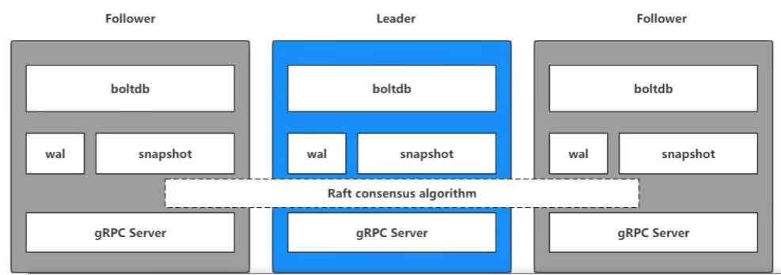

# Etcd 学习

> 适用于共享配置、服务发现、分布式锁、集群监控、leader选举



[下载地址](https://github.com/etcd-io/etcd/releases)

[Go操作etcd](https://www.liwenzhou.com/posts/Go/go_etcd/#autoid-1-5-0)


## Install

```shell
$  tar -zxvf etcd-v3.4.20-linux-amd64.tar.gz
$  cd etcd-v3.4.20-linux-amd64/ 
$  cp etcd etcdctl /usr/local/bin
```

### 检查安装

```shell
$  etcd --version
etcd Version: 3.4.20
Git SHA: 1e26823
Go Version: go1.16.15
Go OS/Arch: linux/amd64

$  etcdctl version
etcdctl version: 3.4.20
API version: 3.4
```

## 启动

```shell
$  etcd --listen-client-urls 'http://0.0.0.0:2379' --advertise-client-urls 'http://0.0.0.0:2379'
```

## 修改配置

### 远程访问

```shell
# 修改/etc/etcd/etcd.conf配置：
$  ETCD_LISTEN_CLIENT_URLS="http://10.103.18.41:2379,http://localhost:2379"
$  etcd --config-file=etcd.conf
```

## etcdctl 操作

### K-V 操作

```shell
$  etcdctl put [KEY] [VALUE]
$  etcdctl get [KEY]
$  etcdctl del [KEY]
```

### 监听K-V变化

会阻塞

```shell
$  etcdctl watch [KEY]
```

### 事务操作

```shell
$  etcdctl txn -i
compares:                           # 条件判断
value("[KEY]") = "[VALUE]"
create("[KEY]") = "[VERSION]"
mod("[KEY]") = "[VERSION]"
...
success requests (get, put, del):   # 条件成立
K-V 操作...
failure requests (get, put, del):   # 条件不成立
K-V 操作...
```

### 租约 

统一管理拥有相同TTL的K-V数据, TTL单位为秒

```shell
$  etcdctl lease grant [DURATION]
lease 694d82dfbbb06c04 granted with TTL(30s)    # 返回租约的hash值
$  etcdctl put [KEY] [VALUE] --lease=694d82dfbbb06c04
```

## 基于etcd实现分布式锁

`go.etcd.io/etcd/clientv3/concurrency` 包在etcd之上实现并发操作，如分布式锁、屏障和选举。

```go
import "go.etcd.io/etcd/clientv3/concurrency"

cli, err := clientv3.New(clientv3.Config{Endpoints: endpoints})
if err != nil {
    log.Fatal(err)
}
defer cli.Close()

// 创建两个单独的会话用来演示锁竞争
s1, err := concurrency.NewSession(cli)
if err != nil {
    log.Fatal(err)
}
defer s1.Close()
m1 := concurrency.NewMutex(s1, "/my-lock/")

s2, err := concurrency.NewSession(cli)
if err != nil {
    log.Fatal(err)
}
defer s2.Close()
m2 := concurrency.NewMutex(s2, "/my-lock/")

// 会话s1获取锁
if err := m1.Lock(context.TODO()); err != nil {
    log.Fatal(err)
}
fmt.Println("acquired lock for s1")

m2Locked := make(chan struct{})
go func() {
    defer close(m2Locked)
    // 等待直到会话s1释放了/my-lock/的锁
    if err := m2.Lock(context.TODO()); err != nil {
        log.Fatal(err)
    }
}()

if err := m1.Unlock(context.TODO()); err != nil {
    log.Fatal(err)
}
fmt.Println("released lock for s1")

<-m2Locked
fmt.Println("acquired lock for s2")
```

输出：

```shell
acquired lock for s1
released lock for s1
acquired lock for s2
```

[详细文档](https://pkg.go.dev/go.etcd.io/etcd/clientv3/concurrency)
