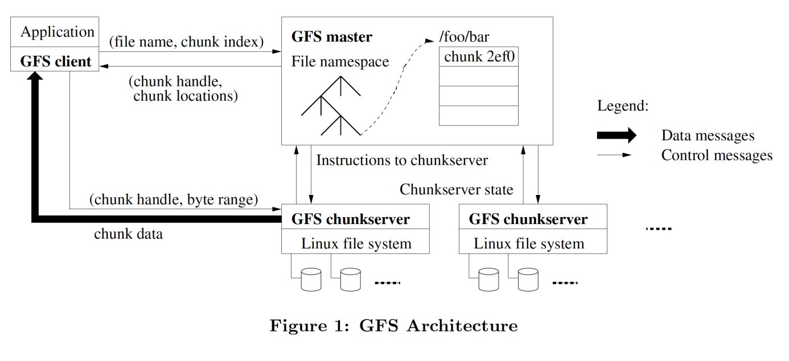
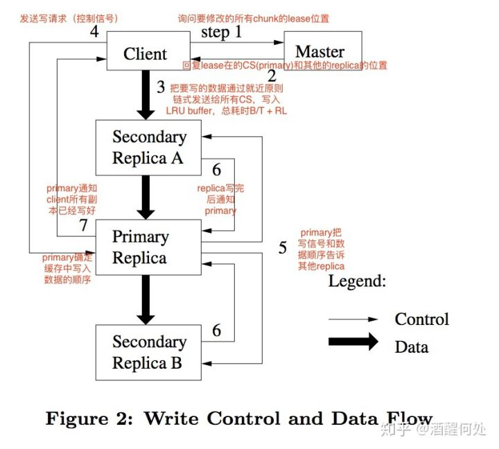
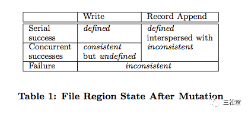

# GFS 解读

>   Google File System
>
>   GFS是为对数据敏感的大型分布式系统所设计的，可伸缩的分布式文件系统。它建立在普通商用电脑上，提供容错机制的同时也能在大量客户端接入的时候保持极高的平均性能。

## 设计思想

经过长期观察，GFS在设计上和传统分布式文件系统相比，有4个不同的考虑重点。

1.   出错是常态。

​				分布式文件系统将几千台普通机器的硬盘连接到一起提供存储服务。良好的设计应该假设这些硬盘会随时出错并且不能恢复。软件bug，OS bug，操作	失误，硬盘损坏，内存，网络出错，甚至停电都会导致整个系统瘫痪。因此，随时监控，错误检测，容错和自动恢复是分布式文件系统的核心。

2.   大文件是常态，GB级的文件是主流。

​	   因此，必须在设计阶段重新考虑方案和参数，比如，IO操作的类型和块大小。GFS虽然支持小文件存储，但不需要太在意效率。

3.   文件追加写是常态，而不是覆盖写。

​	   	文件的随机写是不存在的，一旦开始写入文件，要么只能读，要么顺序写。读又分为大规模的流式读取或小规模的随机读取。流式读取主要是同一个客户端	不间断的顺序读同一个文件，每次都读数百KB或MB级的数据。随机读取，发生在读取一个文件任意位置，每次只读几KB的数据。应用程序本身也是通过顺序	的批量读取和排序来提升系统性能的稳定性，来回反复的去读一个文件是不可取的。写入和读取类似，主要考虑大规模的顺序写。虽然在任意位置的小规模写入	是支持的，但效率极低。

4.   文件数据追加写的性能和原子性是核心考量。

​			GFS上的文件本身经常被用作生产者-消费者队列或多路归并。因此，多客户端（生产者）并发写的同步性能是核心指标。毕竟，随时都会有其他客户		（消费者）同时去读取这些最新写入的数据。

5.   将文件系统和应用程序放在一起设计，以提升弹性。

​			比如，**GFS放松了对一致性的要求**，以简化应用的开发。**GFS提供原子化的追加写操作**，免去了客户端处理同步的逻辑等。**持续的高带宽并低延迟更重	要**，应用程序更关注对数据的高速率处理，而并不关注单次读写的响应时间。

6.   独到的接口设计

     ​		虽然GFS的API设计并不严格遵守POSIX，但大体类似。文件以目录的形式分层组织，使用路径命名。支持create，delete，open，close，read和write操作。除此之外，GFS还提供snapshot和record append功能。Snapshot可以低代价的创建一份文件或目录树的拷贝。Record append提供原子性的append操作，供多个客户端并发写而不用额外加锁。

## 设计架构

+   一个GFS集群包含一个单独的Master节点（译注：这里的一个单独的Master节点的含义是GFS系统中只存在一个逻辑上的Master组件）、多台Chunk服务器，并且同时被多个客户端访问，如上图所示。所有的这些机器通常都是普通的Linux机器，运行着用户级别(user-level)的服务进程。我们可以很容易的把Chunk服务器和客户端都放在同一台机器上，前提是机器资源允许，并且我们能够接受不可靠的应用程序代码带来的稳定性降低的风险。

+   GFS存储的文件都被分割成固定大小的Chunk。在Chunk创建的时候，**Master服务器会给每个Chunk分配一个不变的、全球唯一的64位的Chunk标识。Chunk服务器把Chunk以linux文件的形式保存在本地硬盘上，并且根据指定的Chunk标识和字节范围来读写块数据。**出于可靠性的考虑，每个块都会复制到多个块服务器上。缺省情况下，我们使用3个存储复制节点，不过用户可以为不同的文件命名空间设定不同的复制级别。

+   Master节点管理所有的文件系统元数据。这些元数据包括名字空间、访问控制信息、文件和Chunk的映射信息、以及当前Chunk的位置信息。

+   Master节点还管理着系统范围内的活动，比如，Chunk租用管理、孤儿Chunk(注：orphaned chunks)的回收、以及Chunk在Chunk服务器之间的迁移。

+   Master节点使用心跳信息周期地和每个Chunk服务器通讯，发送指令到各个Chunk服务器并接收Chunk服务器的状态信息。

+   无论是客户端还是Chunk服务器都不需要缓存文件数据。客户端缓存数据几乎没有什么用处，因为大部分程序要么以流的方式读取一个巨大文件，要么工作集太大根本无法被缓存。无需考虑缓存相关的问题也简化了客户端和整个系统的设计和实现。（不过，客户端会缓存元数据。）Chunk服务器不需要缓存文件数据的原因是，Chunk以本地文件的方式保存，Linux操作系统的文件系统缓存会把经常访问的数据缓存在内存中。

## 单一Master节点
单一的Master节点的策略大大简化了我们的设计。单一的Master节点可以通过全局的信息精确定位Chunk的位置以及进行复制决策。另外，**我们必须减少对Master节点的读写**，避免Master节点成为系统的瓶颈。**客户端并不通过Master节点读写文件数据**。反之，客户端向Master节点询问它应该联系的Chunk服务器。客户端将这些元数据信息缓存一段时间，后续的操作将**直接和Chunk服务器进行数据读写操作**。

我们利用图1解释一下一次简单读取的流程。

+   首先，客户端把文件名和程序指定的字节偏移，根据固定的Chunk大小，转换成文件的Chunk索引。

+   然后，它把文件名和Chunk索引发送给Master节点。

+   Master节点将相应的Chunk标识和副本的位置信息发还给客户端。

+   客户端用文件名和Chunk索引作为key缓存这些信息。

+   之后客户端发送请求到其中的一个副本处，一般会选择最近的。

+   请求信息包含了Chunk的标识和字节范围。

+   在对这个Chunk的后续读取操作中，客户端不必再和Master节点通讯了，除非缓存的元数据信息过期或者文件被重新打开。

实际上，客户端通常会在一次请求中查询多个Chunk信息，Master节点的回应也可能包含了紧跟着这些被请求的Chunk后面的Chunk的信息。在实际应用中，这些额外的信息在没有任何代价的情况下，避免了客户端和Master节点未来可能会发生的几次通讯。

### Master节点操作

+   命名空间管理

      		**命名空间的修改通过锁保证为原子性的。**
      	
      		在逻辑上，GFS 的名称空间就是一个全路径和元数据映射关系的查找表。利用前缀压缩，这个表可以高效的存储在内存中。在存储名称空间的树型结构	   	上，每个节点(绝对路径的文件名或绝对路径的目录名)都有一个关联的读写锁。采用这种锁方案的优点是支持对同一目录的并行操作，比如，每一个文件操作需	要获取父目录读锁和目标文件写锁。目录名的读取锁防止目录被删除、 改名以及被快照。

​			**如何避免死锁？**

​			锁的获取依据全局一致的顺序，先按名字空间层次排序，同一层次按字典序排序

+   副本位置分布  

    		GFS中chunk以多副本存储，以提高数据可靠性。一个好的副本位置定义算法满足下面特性：

1.   最大化数据可靠性，例如，不能将所有副本存放在同一个磁盘或者物理机器上；
2.   最大化网络带宽利用率，有效利用多个机架的整合带宽

+   Chunk的创建、负载均衡   

      		当 Master 节点创建一个 Chunk 时，它会选择在哪里放置初始的空的副本，需要考虑以下几个因素：

1.   选择存储空间利用率最低的节点和磁盘；
2.   选择最近一段时间内新建chunk数量较少的节点和磁盘；
3.   将多个副本分散在不同的机架上。

+   垃圾回收 

      		所有 Master 节点不能识别的副本都是“垃圾”。我们很容易能得到 Chunk 的所有引用: 它们都只存储在 Master 服务器上的文件到chunk的映射表中。 我们也可以得到所有 Chunk 的副本:它们都以 Linux 文件的形式存储在 Chunk 服务器的指定目录下。 
      	
      		GFS 在文件删除后不会立刻回收可用的物理空间，空间回收采用惰性的策略，周期性的常规垃圾扫描才回收物理空间，并在 Master 节点相对空闲的时候完成。
      	
      		具体流程：Client提交文件删除操作，Master将删除操作记录到日志，并将对应文件名改为包含删除时间戳的隐藏文件名（改名字，并没有回收物理空间。Master周期性对名字空间做常规垃圾扫描，会在名字空间中删除3天前（时间可配置）的隐藏文件及元数据。ChunkServer在与Master的心跳信息中，得知哪些Chunk的元数据不存在了，便可实际回收其物理空间。直到文件被真正删除，它们仍旧可以用新的特殊的名字读取，也可以通过把隐藏文件改名为正常显示的文件名的方式“反删除”。当隐藏文件被从名称空间中删除，Master 服务器内存中保存的这个文件的相关元数据才会被删除，这也有效的切断了文件和它包含的所有 Chunk 的连接。  
      	
      		 优点：设计简单，批量执行，防误删
      	
      		缺点：存储的开销，阻碍用户调优存储空间使用，特别是当存储空间比较紧缺的时候。我们允许用户为命名空间的不同部分设定不同的复制和回收策略。例如，用户可以指定某些目录树下面的文件不做复制，删除的文件被即时的移除。

## Chunk尺寸
Chunk的大小是关键的设计参数之一。

我们选择了64MB，这个尺寸远远大于一般文件系统的Blocksize。每个Chunk的副本都以普通Linux文件的形式保存在Chunk服务器上，只有在需要的时候才扩大。

惰性空间分配策略避免了因内部碎片造成的空间浪费，内部碎片或许是对选择这么大的Chunk尺寸最具争议一点。选择较大的Chunk尺寸有几个重要的优点。

+   **首先，它减少了客户端和Master节点通讯的需求，因为只需要一次和Mater节点的通信就可以获取Chunk的位置信息，之后就可以对同一个Chunk进行多次的读写操作。**这种方式对降低我们的工作负载来说效果显著，因为我们的应用程序通常是连续读写大文件。即使是小规模的随机读取，采用较大的Chunk尺寸也带来明显的好处，客户端可以轻松的缓存一个数TB的工作数据集所有的Chunk位置信息。
+   **其次，采用较大的Chunk尺寸，客户端能够对一个块进行多次操作，这样就可以通过与Chunk服务器保持较长时间的TCP连接来减少网络负载。**
+   **第三，选用较大的Chunk尺寸减少了Master节点需要保存的元数据的数量**。这就允许我们把元数据全部放在内存中，在2.6.1节我们会讨论元数据全部放在内存中带来的额外的好处。

**另一方面，即使配合惰性空间分配，采用较大的Chunk尺寸也有其缺陷：** 小文件包含较少的Chunk，甚至只有一个Chunk。当有许多的客户端对同一个小文件进行多次的访问时，存储这些Chunk的Chunk服务器就会变成热点。

在实际应用中，由于我们的程序通常是连续的读取包含多个Chunk的大文件，热点还不是主要的问题。

然而，当我们第一次把GFS用于批处理队列系统的时候，热点的问题还是产生了：一个可执行文件在GFS上保存为single-chunk文件，之后这个可执行文件在数百台机器上同时启动。存放这个可执行文件的几个Chunk服务器被数百个客户端的并发请求访问导致系统局部过载。

我们通过使用更大的复制参数来保存可执行文件，以及错开批处理队列系统程序的启动时间的方法解决了这个问题。**一个可能的长效解决方案是，在这种的情况下，允许客户端从其它客户端读取数据。**

## 元数据
Master服务器（注：注意逻辑的Master节点和物理的Master服务器的区别。后续我们谈的是每个Master服务器的行为，如存储、内存等等，因此我们将全部使用物理名称）存储3种主要类型的元数据，包括：

+   文件和Chunk的命名空间
+   文件和Chunk的对应关系
+   每个Chunk副本的存放地点

所有的元数据都保存在Master服务器的内存中。前两种类型的元数据（命名空间、文件和Chunk的对应关系）同时也会以记录变更日志的方式记录在操作系统的系统日志文件中，日志文件存储在本地磁盘上，同时日志会被复制到其它的远程Master服务器上。

**采用保存变更日志的方式，我们能够简单可靠的更新Master服务器的状态，并且不用担心Master服务器崩溃导致数据不一致的风险。**

**<u>Master服务器不会持久保存Chunk位置信息。</u>**Master服务器在启动时，或者有新的Chunk服务器加入时，向各个Chunk服务器轮询它们所存储的Chunk的信息。

### 元数据结构

因为元数据保存在内存中，所以Master服务器的操作速度非常快。Chunk的数量以及整个系统的承载能力都受限于Master服务器所拥有的内存大小。

并且，Master服务器可以在后台简单而高效的周期性扫描自己保存的全部状态信息。这种周期性的状态扫描也用于实现：

+   Chunk垃圾收集
+   在Chunk服务器失效的时重新复制数据通过Chunk的迁移实现
+   跨Chunk服务器的负载均衡
+   磁盘使用状况统计等功能

### Chunk 位置信息

**Master服务器并不保存持久化保存哪个Chunk服务器存有指定Chunk的副本的信息。**

**Master服务器只是在启动的时候轮询Chunk服务器以获取这些信息。**

### 日志

操作日志包含了关键的元数据变更历史记录。

这对GFS非常重要。这不仅仅是因为操作日志是元数据唯一的持久化存储记录，它也作为判断同步操作顺序的逻辑时间基线；文件和Chunk，连同它们的版本，都由它们创建的逻辑时间唯一的、永久的标识。 

把**日志复制到多台远程机器**，并且**只有把相应的日志记录写入到本地以及远程机器的硬盘后，才会响应客户端的操作请求**。

为了缩短Master启动的时间，我们必须**使日志足够小**（注：即重演系统操作的日志量尽量的少）。Master服务器在日志增长到一定量时对系统状态做一次**Checkpoint**，Checkpoint文件以**压缩B-树**形势的数据结构存储，可以直接映射到内存，在用于命名空间查询时无需额外的解析。这大大提高了恢复速度，增强了可用性。

## 数据、控制流

+   读取流：
    1.   client本地计算根据offset计算出chunk index，以file name+chunk index联系master，获取三个chunk副本的handle、localtion信息；
    2.   client联系任意一个chunk，读取对应的数据；

+   写入流：
    1.   client联系master，获取到chunk的handle、localtion信息、主备身份信息；
    2.   client将data发给任意一个chunk，该chunk将data转发给其他chunk；
    3.   当三个chunk都成功将data写入内存，client给primary发送commit请求；
    4.   primary将数据落到本地log中，然后发送commit请求给其他replica。
    5.   当primary收到其他replica写入成功的回复后，返回client success。

## 一致性模型

### 写入接口与文件状态

+   GFS将写操作分为两种：
    1.   write。允许用户指定offset，进行随机写。
    2.   record append。不允许用户指定offset，只能不断往后append写。但是要注意的是这里的append与我们通常所说的在linux fs上append一个文件不同。平常所说在linux fs上append，就是指seek到文件末尾，然后将data写在末尾的下一个byte。而gfs的append，并不保证data会写到文件末尾的下一个byte中，而是由GFS内部选定一个位置写进去，然后把这个位置的offset作为返回值返回给用户。唯一能保证的是：这个GFS内部选定的位置offset，的确在末尾以后，但是可能并不直接与末尾相邻，中间可能夹杂着failed的、duplicated的数据碎片。具体原因我们在后面解释。

+   GFS将文件状态分为两种：
    1.   consistent。也就是一个chunk的多个replica，彼此之间数据一致。
    2.   defined。不仅多个replica彼此之间数据一致（也即consistent），而且replica中的data与某一个用户写入的data保持一致。这句话比较难理解：replica中的数据怎么会跟用户写入的数据不一致呢？

**无论是串行write还是并行write，一旦失败，多个chunk副本上的数据可能都不一致了，其次，客户端从不同的副本上读出的数据也不一样（可能某些副本成功而某些副本失败），因此，必然也是undefined，也是inconsistent;**

**对于append操作，客户端无需指定offset，由chunk主副本根据当前文件大小决定写入offset，在写入成功后将该offset返回给客户端，因此，客户端能够根据offset确切知道写入结果，无论是串行写入还是并发写入，其行为是defined。对于如果append第一次失败，导致多副本在原offset的数据可能不一致，但接下来重试成功，使得在新offset之间的数据一致，因此，其状态是interspersed with inconsistent（部分不一致）。**

### 租约（Lease）

Master 节点为 Chunk 的一个Replica建立一个 Lease,这个副本叫做Primary, Primary对 Chunk 的所有更改操作进行序列化,所有的副本都遵从这个序列进行修改操作。

+   首先为保持Client操作时系统的一致性，Client 需要向 Master 节点询问哪一个 Chunk Server持有指定 Chunk 的 Lease以及其他副本的位置,如果没有就选择其中一个副本建一个 Lease，所有的操作必须在一个Lease 内
+   在租约有效期内： master联系不到Primary，客户端可以联系到Primary。对于修改操作顺序都一致,并没有影响，
+   在租约有效期内：master联系不到Primary, 客户端不可以联系到Primary。对于修改操作所有的操作全都失败，但并不会影响数据的一致性（因为没有数据写入，全部返回失败）
+   当租约失效：master重新选择Primary, 不论客户端联不联系到Primary, 操作都不会受影响（假设联系到原先的chunk,客户端会被告知，其租约已失效，重新到master中获取新的主chunk信息，若在过期前一直联系不到Primary, 到过期后（客户端缓存过期时间）会从新从主master拉取信息）。

**租约机制确保写入的顺序性，并有效的减轻了master的负担，另一方面有效避免了分布式系统中发生 <u>脑裂(split-brain)</u> 的情况**

## **7、快照（snapshot）**

-   快照对系统当前状态进行的一次拍照，用户可以在任意时刻回滚到快照的状态，GFS使用Copy-On-Write技术实现Snapshot。
-   Master节点收到客户端的快照请求时，Master并没有立即对指定Chunk拷贝，而只拷贝其元数据并对指定Chunk的引用计数增1，等到Client需要修改指定Chunk时，再在本地复制，并却保新Chunk拥有租约。

   具体流程是： 

-   收回Snapshot请求覆盖的文件chunk上的租约；
-   操作元数据完成元数据拷贝；
-   客户端要写入该文件的Chunk时，Master通知该Chunk所在ChunkServer进行本地拷贝，之所以本地创建是因为可以避免跨节点之间的数据拷贝，节省网络带宽；
-   发放租约给拷贝Chunk；
-   返回拷贝Chunk的位置信息，接下来客户端的更新流程与正常的没有区别。

## **8、容错**

#### 1）高可用性

-    遵循的2个简单策略：1 快速恢复 2 复制

-   快速恢复：Master或ChunkServer关闭（正常/异常），都被设计在数秒内可恢复状态并重启。Client和其他服务器发现请求超时，会重连重启的Server

-   Chunk的复制：当ChunkServer关闭或Chksum校验出损坏的Chunk副本，Master都会通过复制已有Chunk副本来保障副本个数 

-   Master的复制：CheckPoint文件+操作日志完成Master的恢复。此外，GFS还有些“影子”Master，在Master宕机时提供GFS的只读访问

####   2）数据完整性    

-   -   每个ChunkServer独立维护Checksum来校验自己副本的完整性，每个Chunk块都对应一个32位的Checksum。和其它元数据一样， Checksum 与其它的用户数据是分开的，并且保存在内存和硬盘上，同时也记录操作日志。

        独立维护原因：

        -   跨Chunk服务器比较副本开销大；
        -   追加操作可能造成数据的字节级别不一致，无法通过比较副本判断完整性。

-   对读操作，在把数据返回给客户端或者其它的 Chunk 服务器之前，Chunk 服务器会校验读取操作涉及的范围内的块的checksum, 当checksum校验到数据不正确，ChunkServer会做两件事：1、返回给Client错误信息，让Client读取其他Chunk副本  2、通知Master，请求Chunk副本复制
-   当ChunkServer空闲时，其会周期性扫描不活动的Chunk块，检验数据完整性 
-   读操作的Checksum：只取Chunk小部分额外相关数据进行校验，客户端每次把读取操作对齐在Chunk块的边界上
-   记录追加操作的Checksum（高度优化）：只增量更新最后一个不完整Chunk块的Checksum
-   写操作的Checksum：先读取和校验被写操作覆盖的第一个和最后一个Chunk块，写操作完成后再重新计算和写入Chunksum

