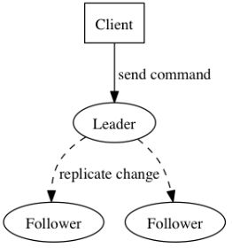

# Raft

>   Raft 算法是一种分布式共识算法，旨在使用简单的、易于理解的机制来构建具有较好一致性的分布式系统。为了强调可理解性，Raft将一致性算法分解为几个关键流程（模块），例如选主，安全性，日志复制，通过将分布式一致性这个复杂的问题转化为一系列的小问题进而各个击破的方式来解决问题。

## Raft 特点

解决集群容错，尽可能避免脑裂问题的发生

+   强 leader：Raft 使用比其他共识算法更强的领导形式，例如日志条目（log entries）仅从 leader 流向其他服务器，这简化了复制日志的管理，使 Raft 更容易理解。
+   Leader 选举：Raft 使用随机计时器(randomized timers)来选举 leaders，这仅为任何共识算法已经需要的心跳增加了少量机制，同时简单快速地解决了冲突。
+   Membershipchanges：Raft使用了一个新机制joint consensus允许集群动态在线扩容，保障Raft的可持续服务能力。

## 复制状态机

所谓的复制状态机，即一个集群中的节点服务器通过复制集群 leader 中的操作日志，进而计算出完全一致的存储数据副本，使得整个集群内的节点服务器存储的数据达到一致。如图所示，每个服务器节点存储包含一系列命令的日志，节点状态机按顺序执行这些命令。由于状态机是确定性的，每个状态机都计算相同的状态和相同的输出序列。因此，集群leader通过对日志信息的控制保证对整个集群服务器的控制，而这种控制就是通过共识算法实现。

## Raft 节点

### 节点状态(Role)

+   Leader
    +   负责与客户端交互
    +   负责整个系统的日志管理与同步
    +   向各个节点发送心跳包（heartbeat），并携带通信信息
+   Follower
    +   响应来自Leader的日志同步请求
    +   响应来自Candidate的拉票请求
    +   转发来自客户端的请求给Leader
+   Candidate
    +   发送拉票请求
    +   准备成为Leader

### 节点任期(Term)

**Raft算法将时间分为一个个的任期（term），每一个term的开始都是Leader选举。在成功选举Leader之后，Leader会在整个term内管理整个集群。如果Leader选举失败，该term就会因为没有Leader而结束。**

+   Raft 算法将时间划分成为任意不同长度的任期（term）。任期用连续的数字进行表示。每一个任期的开始都是一次选举（election），一个或多个候选人会试图成为领导人。如果一个候选人赢得了选举，它就会在该任期的剩余时间担任领导人。在某些情况下，选票会被瓜分，有可能没有选出领导人，那么，将会开始另一个任期，并且立刻开始下一次选举。Raft 算法保证在给定的一个任期最多只有一个领导人。
+   服务器之间通信的时候会交换当前任期号；如果一个服务器的当前任期号比其他的小，该服务器会将自己的任期号更新为较大的那个值。如果一个 candidate 或者 leader 发现自己的任期号过期了，它会立即回到 follower 状态。如果一个节点接收到一个包含过期的任期号的请求，它会直接拒绝这个请求。

### 节点通信(RPC)

Raft 算法中服务器节点之间通信使用远程过程调用（RPC），并且基本的一致性算法只需要两种类型的 RPC，为了在服务器之间传输快照增加了第三种 RPC：

>   （1）RequestVote RPC：候选人在选举期间发起。
>   （2）AppendEntries RPC：领导人发起的一种心跳机制，复制日志也在该命令中完成。
>   （3）InstallSnapshot RPC: 领导者使用该RPC来发送快照给太落后的追随者。

## Leader Election

Raft 使用心跳（heartbeat）触发Leader选举。当服务器启动时，初始化为Follower。Leader向所有Followers周期性发送heartbeat。如果Follower在选举超时时间内没有收到Leader的heartbeat，就会等待一段随机的时间后发起一次Leader选举。

每一个follower都有一个时钟，是一个随机的值，表示的是follower等待成为leader的时间，在一个时钟内收到来自Leader的心跳包，则重置时钟，谁的时钟先跑完，则发起leader选举。

Follower将其当前term加一然后转换为Candidate。它首先给自己投票并且给集群中的其他服务器发送 RequestVote RPC。结果有以下三种情况：

1.   **赢得选举**：如果一个 candidate 在同一个任期内从这个集群中的大多数服务获得选票，那么它就赢得了选举。每个服务器将在给定的任期内以先到先得的方式投票给至多一名候选者（注意：第 5.4 节增加了对投票的额外限制）。多数规则确保最多一名 candidate 可以赢得特定任期的选举，一旦一个 candidate 赢得了选举它就会成为 leader，然后它向所有其它服务器发送心跳消息以建立其权限并阻止新的选举。

2.   **输掉选举**：在等待投票时， candidte 可能会收到来自另一台声称是 leader 服务的 AppendEntries RPC。如果该 leader 的任期（包含在其 RPC 中）大于等于 candidate 当前任期，则 candidate 将 leader 视为合法并返回 follower 状态。否则将拒绝 RPC 并继续处于 candidate 。

     

3.   **无人胜出**：第三种可能的结果是这次选举candidate既没赢也没输：如果同时有多个 follower 成为 candidate ，可能会分裂选票，导致没有 candidate 获得多数票，发生这种情况时，每个 candidate 将超时并通过增加其任期并启动另一轮 RequestVote RPC 来开始新的选举。然而如果没有额外的措施，分裂选票可能会无限期地重复。

     

## Log Replication

当Leader被选举出来后，用户的每一个提交的操作都会被Leader追加到本地日志中，根据与客户端的交互的情况实施长期周期性的日志复制操作，Leader 必须确保新增条目被安全复制且持久化（**AppendEntries RPC**）后，才会将该条目交给状态机来执行，然后返回执行结果。

如何界定新增条目的安全持久化？

### Commited 状态

当某新增条目（Entry）被**<u>过半</u>**的Follower都安全的接收并持久化新增条目时，则称该条目Commited，该状态的条目能够确保能被可用的状态机执行。

### Raft日志特性

-   如果不同日志中的两个条目拥有相同的索引和任期号，那么他们存储了相同的指令。
-   如果不同日志中的两个条目拥有相同的索引和任期号，那么他们之前的所有日志条目也都相同。

1.   **第一个特性**：leader在给定的term和index上只能创建一个entry，而且entry不被允许修改位置。

2.   **第二个特性**：通过**<u>AppendEntries</u>**执行的简单一致性来保证。

     首先从leader发出的AppendEntries中有两个比较重要的参数：

     1.   prevLogIndex ：新entry对应的前一个entry对应的LogIndex（也就是leader当前日志中最后一个entry对应的log index）
     2.   prevLogTerm : 新entry对应的前一个entry对应的term（也就是leader当前日志中最后一个entry对应的log term）

follower收到AppendEntries请求后，查看自己的log当中有没有prevLogIndex、prevLogTerm对应的entry。followed发现自己日志没有的话，就说明自己的日志滞后当前的leader，拒绝将entries添加到自己的log中。

**通过维护以上两个特性，可以保持Leader进行日志复制时的高一致性**

1.   通过AppendEntries 找到日志冲突点，就是follower从哪个位置开始和leader的日志不一致了
2.   leader把follower日志冲突点以后的日志强行刷新成自己的。

具体细节就是leader会向follower不间断的发送AppendEntries请求，如果follower返回false的话，那就证明follower和leader不一致。那么leader发送的AppendEntries就会把 index减1再次发送，直至和follower匹配上。匹配成功以后，通过AppendEntries请求将leader上的entries同步至follower。

论文中有提到的一个优化手段就是AppendEntries请求返回失败同时，follower也返回冲突entry所在的任期和所在任期的第一个entry对应的logIndex。通过这两个信息，leader调整下次发送的prevLogIndex和prevLogTerm,可以减少rpc请求。

## Safety

