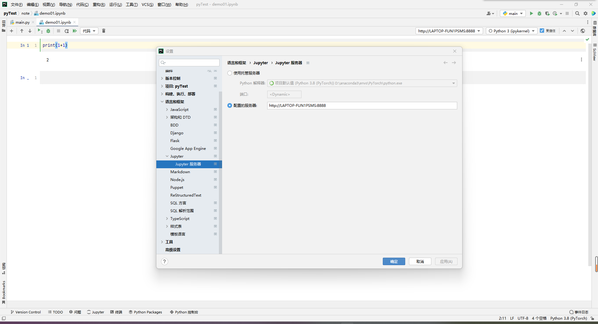

# Conda 安装 Jupyter


>   请确保已经配置好了conda的环境


## Install

```bash
# conda新建一个环境
$ conda create -n jupyter -y
# 激活jupyter环境
$ conda activate jupyter 
# 安装jupyter
$ conda install jupyter -y
```

## Config

```bash
$ jupyter notebook --generate-config
# 此处会显示自动生成的配置文件的位置
# 默认在C:/user/xxx/.jupyter/
```

在该终端打开python，执行以下代码：

```python
from notebook.auth import passwd
passwd()
# 输入密码，再次输入
# 此处会显示生成的密码串 'xxxxxxxxxxxxx'
exit()
```

打开配置文件

```python
# 插入下面的内容
c.NotebookApp.ip='*'
c.NotebookApp.password=u'argon2:$argon2id$v=19$m=10240,t=10,p=8$OBOjmJ9BxdyrtuY4acfI9g$iwU6g+wQHTNeJJQ0DAjJXjj6azUpJ8oDFvjKxnqxfWw' # 上方生成的密码串前加上子母u
c.NotebookApp.open_browser=False
c.NotebookApp.port=8888
```

## Run

```bash
# 激活你所安装jupyter的conda环境后
$ jupyter notebook
```


## Pycharm 中使用 Jupyter

+   新建jupyter notebook页面
+   配置jupyter服务器地址， 输入密码
+   按上述启动jupyter



