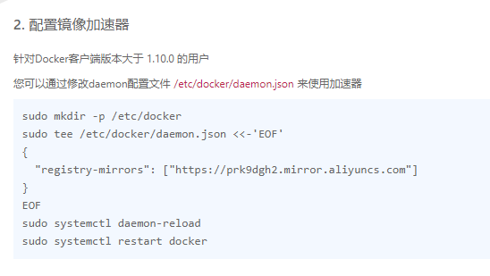
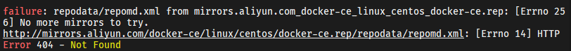
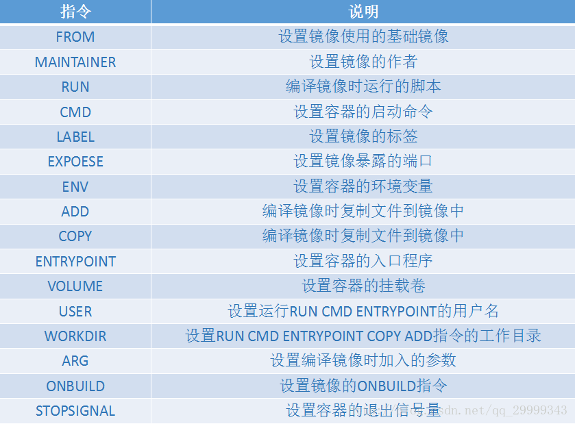
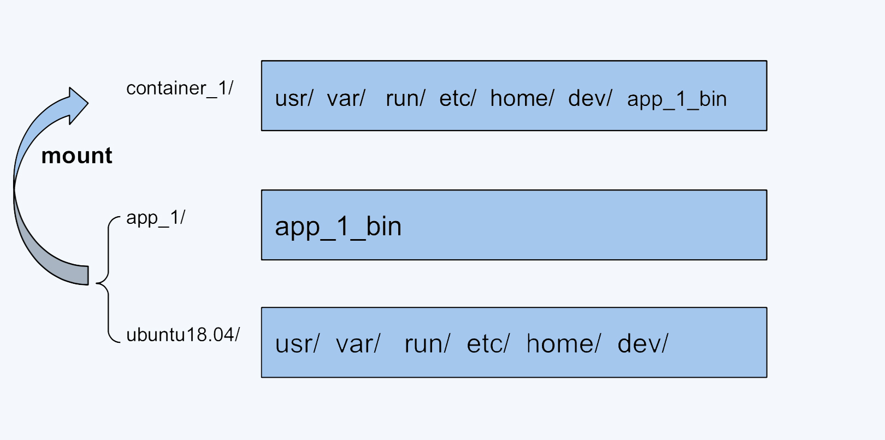

# Profile

>_Docker_ 是一个开源的应用容器引擎，让开发者可以打包他们的应用以及依赖包到一个可移植的镜像中，然后发布到任何流行的 Linux或Windows操作系统的机器上，也可以实现虚拟化。容器是完全使用沙箱机制，相互之间不会有任何接口

## Install
[Docker官网centos平台安装文档](https://docs.docker.com/engine/install/centos/)
```bash
# 卸载旧版本
sudo yum remove docker \
                  docker-client \
                  docker-client-latest \
                  docker-common \
                  docker-latest \
                  docker-latest-logrotate \
                  docker-logrotate \
                  docker-engine
# 安装依赖的包
sudo yum install -y yum-utils

# 配置镜像仓库
sudo yum-config-manager --add-repo http://mirrors.aliyun.com/docker-ce/linux/centos/docker-ce.repo

# 更新软件包
sudo yum makecache fast

# 安装
sudo yum install docker-ce docker-ce-cli containerd.io docker-buildx-plugin docker-compose-plugin

sudo yum install docker-ce-<VERSION_STRING> docker-ce-cli-<VERSION_STRING> containerd.io docker-buildx-plugin docker-compose-plugin

yum -y install docker-ce-19.03.8-3.el7 docker-ce-cli-19.03.8-3.el7 containerd.io-1.2.5-3.1.el7 docker-buildx-plugin docker-compose-plugin

# 启动docker
sudo systemctl start docker

# 测试安装
docker version
sudo docker run hello-world

```

**配置阿里云镜像加速**
登录->控制台->侧边栏产品与服务->容器镜像服务->镜像加速器


## Error
+  yum软件包更新时，阿里docker源出错
	
	解决：切换到 `/etc/yum.repos.d` 目录下，将所有 docker 相关的 `repo`全部删掉后，重新添加镜像，命令如上。
+ 低版本需要 `yum -y install deltarpm`
+ etc

# Command
>常用命令 

[官方DOC](https://docs.docker.com/engine/reference/commandline/cli/)
## Help
```bash
docker version
docker info
docker [command] --help
```

## Image
> iid: image_id
> cid: container_id
```bash
# 查看所有镜像
dokcer images

# 搜索
docker search

# 下载
# docker pull mysql:latest
docker pull image_name[:tag]

# 删除
docker rmi -f [iid]
docker rmi -f $(docker images -qa) # 删除全部镜像

# 发布(推送)镜像
docker tag ubuntu:18.04 username/ubuntu:18.04
docker push username/ubuntu:18.04

```

## Container
```bash
# 新建容器并启动
docker run [option] image
# 参数
--name="" 容器名称
-d        后台方式启动
-it       交互式启动，并进入容器
-p        指定容器端口 
	-p 主机端口:容器端口
	-p 容器端口
-P        随机指定端口
-volumes-from 数据卷容器名（同步数据）

# 创建容器
docker create image

# 退出容器
exit # 停止并退出
Ctrl+p+q # 退出

# 进入容器
docker exec -it cid # 新命令行
docker attach cid # 原命令行


# 查看运行的容器
docker ps # 正在运行
docker ps -a # 正在运行以及运行过的容器

# 删除容器
docker rm cid
dokcer rm -f $(docker ps -aq) # 删除所有容器

# 启动于停止
docker start cid # 启动
docker restart cid # 重启
docker stop cid # 停止
docker kill cid # 强制停止

# 查看容器中进程信息
docker top cid

# 查看容器元信息
docker inspect cid

# 从容器中拷贝到主机
docker cp 

```

## Log
```bash
# 打印日志
docker logs -tf --tail [num] cid
```

## Image Commit
```bash
# 提交容器成为镜像
docker commit -m="msg" -a="author" cid image[:tag] 
```


## Archive
```bash
# 保存镜像为 tar 归档文件
docker save [OPTIONS] IMAGE [IMAGE...]
docker save -o xxx.tar image
# 载入镜像包,恢复为镜像
docker load [OPTIONS]
docker load < xxx.tar

# 保存容器为 tar 归档文件
docker export [OPTIONS] CONTAINER
# 将容器归档恢复为镜像，会损失元数据 
docker import [OPTIONS] file|URL|- [REPOSITORY[:TAG]]
```

# 容器数据卷

+ 卷就是目录和文件，存在于一个或多个容器中，由docker挂载到容器，但不属于联合文件系统，因此能够绕过union file system提供一些用于持续存储或共享数据的特性。（将docker容器内的数据保存进宿主机的磁盘中）
+ 卷的设计目的就是数据持久化（类似于redis中的rdb和aof文件），完全独立于容器的生命周期，因此docker不会在容器删除时删除其挂载的容器卷。

## Usage

> usage 1: 直接指定目录
```bash
docker run -it -v 主机目录:容器目录 image
```
> usage 2: 未直接指定
```bash
# 具名挂载
docker run -v 卷名:容器目录 image
# 匿名挂载
docker run -v 容器目录 image

# 查看所有卷
docker volume ls
# 查看某卷信息
docker volume inspect 卷名

# 权限
:ro readonly
:rw readwrite
```
**未指定目录的卷一般在**`/var/lib/docker/volumes/卷名/_data`**目录下**
> usage 3: Dockerfile
```dockerfile
FROM centos

VOLUME ["",""]

CMD echo "sss"
```


# Dockerfile
>Dockerfile 是一个用来构建镜像的文本文件，文本内容包含了一条条构建镜像所需的指令和说明。

## Grammar


+ RUN 是在 docker build 时运行
+ CMD 在docker run 时运行
+ **CMD 命令只有最后一个会生效**
+ 
```dockerfile
FROM <image>[:<tag> | @<digest>]
MAINTAINER <name>

# RUN指令会生成容器，在容器中执行脚本，容器使用当前镜像，脚本指令完成后
# Docker Daemon会将该容器提交为一个中间镜像，供后面的指令使用
# RUN指令第一种方式为shell方式，使用/bin/sh -c <command>运行脚本，可以在其中使用将脚本分为多行
# RUN指令第二种方式为exec方式，镜像中没有/bin/sh或者要使用其他shell时使用该方式，其不会调用shell命令
RUN <command> 
RUN ["executable","param1","param2"]

# 为启动的容器指定默认要运行的程序，程序运行结束，容器也就结束。CMD 指令指定的程序可被 docker run 命令行参数中指定要运行的程序所覆盖。
# CMD 可为 ENTRYPOINT 提供参数列表
CMD <command>
CMD ["",""]

# 类似于 CMD 指令，但其不会被 docker run 的命令行参数指定的指令所覆盖，而且这些命令行参数会被当作参数送给 ENTRYPOINT 指令指定的程序。
ENTRYPOINT <command>
ENTRYPOINT ["<executeable>","<param1>","<param2>",...]


```
## Build
```bash
docker build -f -t
```

---

# UnionFS
> 联合文件系统（Union File System）

+ **UnionFS的核心就是高效的利用磁盘空间**
+ **UnionFS 这类文件系统实现的主要功能是把多个目录（处于不同的分区）一起挂载（mount）在一个目录下**
+ **UnionFS允许只读和可读写目录并存，就是说可同时删除和增加内容。UnionFS具有写时复制(copy-on-write)功能，UnionFS可以把只读和可读写文件系统合并在一起，虚拟上允许只读文件系统的修改可以保存到可写文件系统当中**


docker中使用到了UnionFS，任何程序运行时都会有依赖，无论是开发语言层的依赖库，还是各种系统lib、操作系统等，不同的系统上这些库可能是不一样的，或者有缺失的。为了让容器运行时一致，docker将依赖的操作系统、各种lib依赖整合打包在一起（即镜像），然后容器启动时，作为它的根目录（根文件系统rootfs），使得容器进程的各种依赖调用都在这个根目录里，这样就做到了环境的一致性。

比如，我们可以把 ubuntu18.04 这个基础镜像的文件放在一个目录 ubuntu18.04/ 下，容器自己额外的程序文件 app_1_bin 放在 app_1/ 目录下。然后，我们把这两个目录挂载到 container_1/ 这个目录下，作为容器 1 看到的文件系统；对于容器 2，就可以把 ubuntu18.04/ 和 app_2/ 两个目录一起挂载到 container_2 的目录下。这样在节点上我们只要保留一份 ubuntu18.04 的文件就可以了。
[相关](https://www.ngui.cc/el/647713.html?action=onClick)


```bash
[root@master ~]# kubectl create deployment nginx --image=nginx
deployment.apps/nginx created
[root@master ~]# kubectl expose deployment nginx --port=80 --type=N                   odePort

```